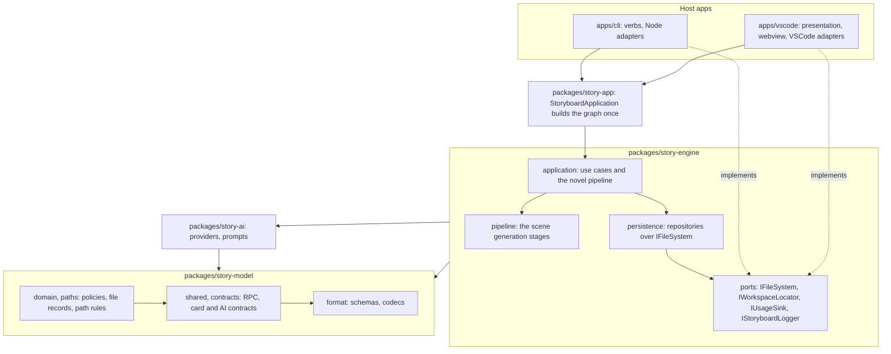

# Storyboard Extension Overview

`storyboard` is a VSCode extension intended to become a one-click long-form novel generation IDE: it should plan, draft, review, revise, and assemble a full manuscript from project-level creative constraints.

The current implementation is still smaller than that target. Treat `scene/*.card → draft/*.md`, cards, canon, and draft diagnostics as the first working slice of a larger autonomous fiction pipeline rather than the final product boundary.

The repository is an npm-workspaces monorepo (`workspaces: ["apps/*", "packages/*"]`) with a single root `package-lock.json` and **one version for the whole repo**, held in the root manifest and mirrored into the apps by `npm run version:sync`.

The apps share `packages/story-engine` and know nothing about each other. Only the host adapters differ: file system, workspace locator, logger, secrets, configuration, usage sink. `packages/story-app` takes those adapters and builds the engine's object graph once (`StoryboardApplication`), so no app assembles a use case itself.

## Monorepo Layout

| Workspace | Name | Role |
|---|---|---|
| `apps/vscode` | `storyboard-vscode` | The VSCode extension. Ships in the VSIX; its version is mirrored from the root manifest. |
| `apps/cli` | `@storyboard/cli` | Command line app (`storyboard`). The headline product and reference implementation; other AI agents drive Storyboard through it. |
| `apps/desktop` | `@storyboard/desktop` | Electron app for writers who are not developers: the manuscript desk with the run drawer, the story bible, automatic version history. Rules in `.claude/rules/desktop.md`. |
| `packages/story-engine` | `@storyboard/story-engine` | Runtime-agnostic core: use cases, repositories over the host ports, post-generation updaters, and both pipelines (`application/novel`, `pipeline/`). |
| `packages/story-app` | `@storyboard/story-app` | The shared composition root: `StoryboardApplication` takes a host's six adapters and builds every repository, use case and the novel pipeline once. It exposes one manager per domain — `drafts`, `manuscript`, `cards`, `novel`, `studio`, `notes` — and the apps speak only to those. |
| `packages/story-model` | `@storyboard/story-model` | Everything the other packages agree on, with no I/O: the workspace file format (`format/`: schemas, codecs, path conventions, the shared round-trip fixtures), the AI contracts and catalogs (`contracts/`), the RPC and card contracts (`shared/`), pure policies and file records (`domain/`) and project path rules (`paths/`). Its `/contracts` entry is the one browser-safe entry. |
| `packages/story-ai` | `@storyboard/story-ai` | AI engine: provider registry, prompt catalog, and the `SecretStore`/`ConfigBridge` ports. |
| `packages/story-config` | `@storyboard/story-config` | The shared home `~/.storyboard`: `config.json` layers (home ← workspace `.storyboard/config.json`), the 0600 `secrets.json`, and file watchers. Every app reads settings through it. |
| `packages/story-node` | `@storyboard/story-node` | Node host adapters shared by every app that runs on Node: `NodeFileSystem` (temp-file-then-rename writes) and `NodeWorkspaceLocator` (one workspace, containment test). |

Packages expose TypeScript **source** (no build step); each app resolves them through its own
tsconfig `paths`, esbuild `alias`, and vitest `alias` — three places, all of which must agree.
The root `scripts/architecture/check-workspace.mjs` (run first by the root `npm run lint`) enforces
that no package imports `vscode` or an app module.

Both apps write through the same codecs, so a card edited in the editor or from the terminal
serializes to identical bytes — the shared fixtures in
`packages/story-model/test/fixtures/` are the round-trip guard for that claim.

## Current Architecture

The package direction is one line: `story-model ← story-ai ← story-engine ← story-app`.

What each check actually enforces, so a green run is not read as more than it is:

- `scripts/architecture/check-workspace.mjs` (repo root, the first step of the root `npm run lint`)
  — every shared package stays free of `vscode` (including inline `import('vscode')` types), of app
  imports (`@/`, `@webview/`) and of another package's `#` internal prefix; and an owned literal
  (`OWNED_LITERALS`) appears only in its owner file across every app and package.
- `apps/vscode/scripts/check-architecture.mjs` — the extension entry may import only `vscode` and
  `./bootstrap/*`; `infrastructure` may not import `presentation` or `bootstrap`; no import cycles.
  The inner layers left for the engine, so nothing here validates them any more.
- `apps/cli` enforces its own ordered layer direction and rejects cycles, and additionally fails
  if it imports the engine's pipeline assembly symbols (`refusePipelineAssembly` in
  `scripts/architecture/runner.mjs`), which would be a second copy of the generation loop. The
  desktop applies the same rule.
- `packages/story-model` — its own layer direction: `format` may import only itself, `contracts`
  only `contracts`/`format`, then `shared`, `domain` and `paths` each only what is before them; plus
  no cycles.
- `packages/story-engine` — `pipeline`, `ports` and `ai` may each import only themselves (and other
  packages); plus no cycles. `persistence` and `application` are a mutually dependent pair by design
  (application declares the repository ports, persistence implements them), so no order is imposed
  between those two.

## Narration and Composition

시점은 `setting.pov`(5값: `first`, `first-retrospective`, `second`, `third-limited`,
`third-omniscient`) 하나로 시작하고, 이름 붙인 서술자가 필요해지면 `narrator/*.card`를 만든다.
카드는 인칭·지식 경계(`witnessed`/`omniscient`/`retrospective`)·시제·초점 인물·목소리를 갖는다.
해석은 **씬 카드 > `chapters.yaml`의 장 > 프로젝트 기본** 순이며, 아무것도 없으면 프롬프트에
시점 지시가 나가지 않는다(기존 작품의 결과가 달라지지 않게 하려는 의도).

구성(`setting.composition`)은 `linear` / `omnibus` / `alternating-pov` / `frame` 네 프리셋이고,
프리셋이 연속성 줄기(`setting.threads`)와 서술자 카드를 만든다. 줄기는 이야기 상태 원장·장
요약·직전 씬 맥락·페르소나/배경 기억의 스코프다 — 기본 줄기 `main`은 종전 경로를 쓰고 나머지는
`.storyboard/memory/threads/<id>/` 아래로 내려가며, **캐넌만 전역으로 공유**된다. 씬 번호는
전역으로 유지되고 원고 조립도 번호순이다.

지식 경계는 이야기 상태 원장의 항목마다 기록된 목격자(`- [12|hana,jun] …`)로 강제된다.
`witnessed` 서술자의 초점 인물이 목격자에 없으면 그 항목은 프롬프트에서 빠지고, 목격자가 없는
구 버전 항목은 판정할 수 없으므로 통과시킨다. 목격자는 `storyStateUpdate`가 항목마다 이름으로 달고
(없거나 단 이름 중 하나라도 카드와 맞지 않으면 씬 전원), 뼈대와 인물별 대사 다듬기는 인물마다 자기가
목격한 항목만 `[아는 것]`으로 받는다. 전지적 서술이 아니면 뼈대의 공용 `[이야기 상태]`에는 씬 인물 모두가
목격한 항목만 남는다(한 인물만 아는 것은 그 인물의 `[아는 것]`으로만 간다). 씬 카드의 비트는 `cast`·`place`·`time` 좌표를 달 수 있고, 대사
다듬기는 인물 하나에 호출 하나이며 검증은 번호 단위, 재호출은 인물 단위다(끝내 위반한 번호만 뼈대 대사로 남는다).
다듬기는 원장의 관계 변화를 받아 카드의 상대별 말투(`relations[].speech`)보다 앞세운다.

## Domain Boundaries

- **Extension host**: VSCode activation, commands, panels/views, persistence, file system access, external API access.
- **Webview UI**: Rendering, user interactions, local UI state.
- **Shared types**: Message contracts, settings/state interfaces, domain DTOs.

## State Strategy

- Settings live in `~/.storyboard/config.json` (all workspaces) and `<workspace>/.storyboard/config.json` (one workspace), read and written through `ConfigBridge` over `@storyboard/story-config`; the extension contributes no VSCode `configuration`.
- Credentials live in `~/.storyboard/secrets.json` (0600) through `SecretStore`, shared with the CLI.
- Use `context.workspaceState` only for transient editor state that no other app needs.
- Avoid duplicating persistent state in the webview; treat extension host state as the source of truth.

## Communication Strategy

- Use typed message contracts for extension ↔ webview communication.
- Validate message shape at boundaries when messages carry user input or external data.
- Keep long-running work in the extension host and report progress to the webview.

## Reference to Cline

Cline demonstrates a mature VSCode extension architecture with extension-host orchestration, webview communication, persistent state, and task execution patterns. For `storyboard`, borrow the ideas that fit the immediate product scope and avoid unnecessary complexity until needed.

## Product Direction

- Prefer features that move Storyboard toward autonomous long-form generation: project contract, outline, scene seed factory, draft loop, review loop, and manuscript assembly.
- Keep every autonomous step inspectable as files or diagnostics so users can understand and rerun failed stages.
- Do not assume one giant prompt is the architecture for generating a novel. Break generation into typed, restartable stages.

## Tracked documentation

- `ARCHITECTURE.md` (repo root) for product concept, workspace layout, and file formats.
- `RELEASE.md` (repo root) for version commits, tags, and GitHub Releases.
- `apps/vscode/EXTENSION_QA.md` for manual extension QA.
- `apps/vscode/GUIDE.md` for draft editor features.
- `apps/cli/GUIDE.md` for what the CLI's screens look like; its screenshots live in `apps/cli/docs/screenshots/`.
- Optional local-only `.doc/` (gitignored) for migration plans and ADRs.
