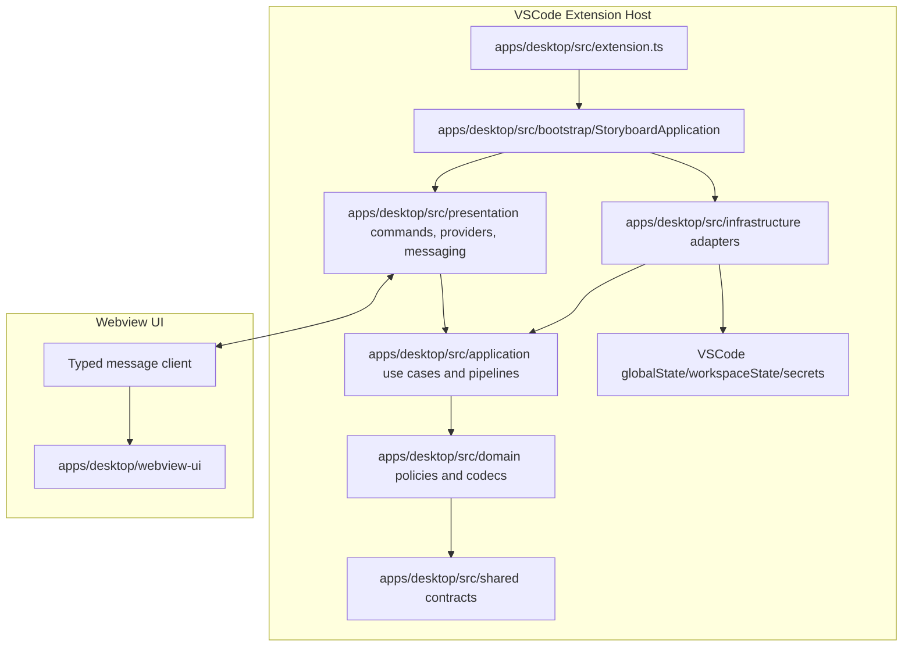

# Storyboard Extension Overview

`storyboard` is a VSCode extension intended to become a one-click long-form novel generation IDE: it should plan, draft, review, revise, and assemble a full manuscript from project-level creative constraints.

The current implementation is still smaller than that target. Treat `scene/*.card → draft/*.md`, cards, canon, and draft diagnostics as the first working slice of a larger autonomous fiction pipeline rather than the final product boundary.

The repository is an npm-workspaces monorepo (`workspaces: ["apps/*", "packages/*"]`) with a single root `package-lock.json` and **one version for the whole repo**, held in the root manifest and mirrored into the apps by `npm run version:sync`.

The three apps share `packages/story-engine` and know nothing about each other. Only the host adapters differ: file system, workspace locator, logger, secrets, configuration, usage sink.

## Monorepo Layout

| Workspace | Name | Role |
|---|---|---|
| `apps/desktop` | `storyboard-vscode` | The VSCode extension. Holds the released version and the only `v*` tag. |
| `apps/bot` | `@storyboard/bot` | Telegram front end (`storyboard-bot`). Edits the **same** git workspace — no clone, no separate store. |
| `apps/cli` | `@storyboard/cli` | Command line app (`storyboard`). The headline product and reference implementation; other AI agents drive Storyboard through it. |
| `packages/story-engine` | `@storyboard/story-engine` | Runtime-agnostic core: domain policies, file records, and the RPC/contract types every app speaks. Holds what used to be `apps/desktop/src/{domain,shared}`. |
| `packages/story-format` | `@storyboard/story-format` | Workspace file format: schemas, codecs, path conventions, pure narrative helpers, and the shared round-trip fixtures. |
| `packages/story-ai` | `@storyboard/story-ai` | AI engine: provider registry, prompt catalog, response contracts, and the `SecretStore`/`ConfigBridge` ports. |
| `packages/story-git` | `@storyboard/story-git` | Commit/sync layer: `GitClient`, `SyncService`, push scheduling, and workspace git onboarding. |

Packages expose TypeScript **source** (no build step); each app resolves them through its own
tsconfig `paths`, esbuild `alias`, and vitest `alias`. `apps/desktop/scripts/check-architecture.mjs`
enforces that no package imports `vscode` or an app module.

Both apps write through the same codecs, so a card edited in Telegram and a card edited in VSCode
serialize to identical bytes — the shared fixtures in `packages/story-format/test/fixtures/` are the
round-trip guard for that claim.

## Current Extension-Host Architecture

The legacy `core`/`files`/`services`/`commands`/`providers`/`messaging`/`utils`/`constants` directories have been fully migrated into the target layers; `apps/desktop/scripts/check-architecture.mjs` now enforces layer direction (no reverse imports, no cycles, no `vscode` import outside the allowed layers).

## Domain Boundaries

- **Extension host**: VSCode activation, commands, panels/views, persistence, file system access, external API access.
- **Webview UI**: Rendering, user interactions, local UI state.
- **Shared types**: Message contracts, settings/state interfaces, domain DTOs.

## State Strategy

- Use `context.globalState` for user settings that apply across workspaces.
- Use `context.workspaceState` for workspace-specific state.
- Use `context.secrets` for credentials and sensitive tokens.
- Avoid duplicating persistent state in the webview; treat extension host state as the source of truth.

## Communication Strategy

- Use typed message contracts for extension ↔ webview communication.
- Validate message shape at boundaries when messages carry user input or external data.
- Keep long-running work in the extension host and report progress to the webview.

## Reference to Cline

Cline demonstrates a mature VSCode extension architecture with extension-host orchestration, webview communication, persistent state, and task execution patterns. For `storyboard`, borrow the ideas that fit the immediate product scope and avoid unnecessary complexity until needed.

## Product Direction

- Prefer features that move Storyboard toward autonomous long-form generation: project contract, outline, scene seed factory, draft loop, review loop, and manuscript assembly.
- Keep every autonomous step inspectable as files or diagnostics so users can understand and rerun failed stages.
- Do not assume one giant prompt is the architecture for generating a novel. Break generation into typed, restartable stages.

## Tracked documentation

- `ARCHITECTURE.md` (repo root) for product concept, workspace layout, and file formats.
- `RELEASE.md` (repo root) for version commits, tags, and GitHub Releases.
- `apps/desktop/EXTENSION_QA.md` for manual extension QA.
- `apps/desktop/GUIDE.md` for draft editor features.
- Optional local-only `.doc/` (gitignored) for migration plans and ADRs.
