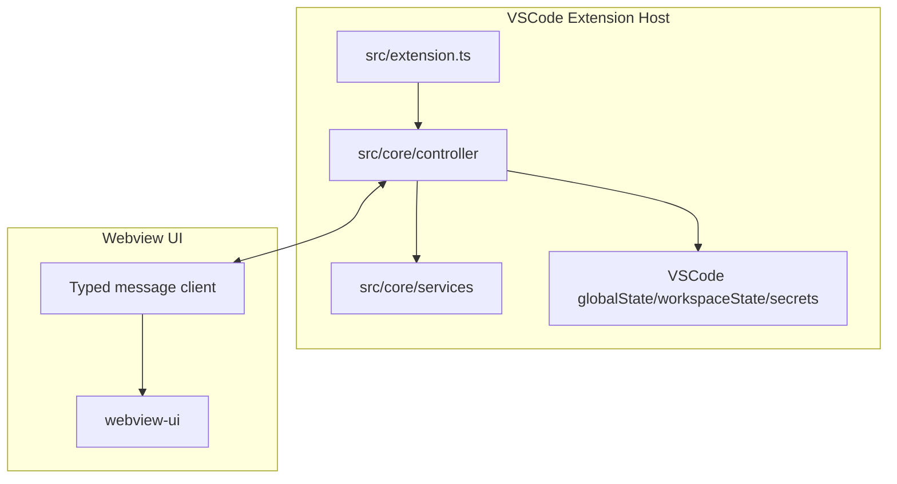

# Storyboard Extension Overview

`storyboard` is planned as a VSCode extension. The exact product behavior is still evolving, so this document describes the intended technical foundation rather than fixed implementation details.

## Intended Architecture

## Domain Boundaries

- **Extension host**: VSCode activation, commands, panels/views, persistence, file system access, external API access.
- **Webview UI**: Rendering, user interactions, local UI state.
- **Shared types**: Message contracts, settings/state interfaces, domain DTOs.

## State Strategy

- Use `context.globalState` for user settings that apply across workspaces.
- Use `context.workspaceState` for workspace-specific state.
- Use `context.secrets` for credentials and sensitive tokens.
- Avoid duplicating persistent state in the webview; treat extension host state as the source of truth.

## Communication Strategy

- Use typed message contracts for extension ↔ webview communication.
- Validate message shape at boundaries when messages carry user input or external data.
- Keep long-running work in the extension host and report progress to the webview.

## Reference to Cline

Cline demonstrates a mature VSCode extension architecture with extension-host orchestration, webview communication, persistent state, and task execution patterns. For `storyboard`, borrow the ideas that fit the immediate product scope and avoid unnecessary complexity until needed.

## Tracked documentation

- `ARCHITECTURE.md` for product concept, workspace layout, and file formats.
- `STORYBOARD_ALIGNMENT.md` for `.seed` exchange policy with Seeds.
- `EXTENSION_QA.md` for manual extension QA.
- `RELEASE.md` for version commits, tags, and GitHub Releases.
- `GUIDE.md` for draft editor features.
- Optional local-only `.doc/` (gitignored) for migration plans and ADRs.
