# Storyboard CLI 화면 가이드

`storyboard`를 터미널에서 쓸 때 보게 되는 화면을 순서대로 정리합니다. 명령과 옵션의 전체 목록은
[README](README.md)에 있고, 이 문서는 «무엇이 어떻게 보이는가»를 다룹니다.

색·기호·상자는 사람이 터미널에서 볼 때만 붙습니다. 파이프, `--json`, `--no-color`, `NO_COLOR`,
`TERM=dumb`에서는 꾸밈 없는 글자만 나가므로 다른 프로그램이 읽는 출력은 달라지지 않습니다.

## 1) 도움말

`storyboard --help`는 처음 할 일 여섯 단계와 명령 묶음만 보여 줍니다. 묶음은 명사를 따르며
(시작하기 · 기획 · 씬 · 초안 · 카드와 정전 · 노트 · 원고 · 측정) 같은 명사가 두 묶음에 나뉘지
않습니다.

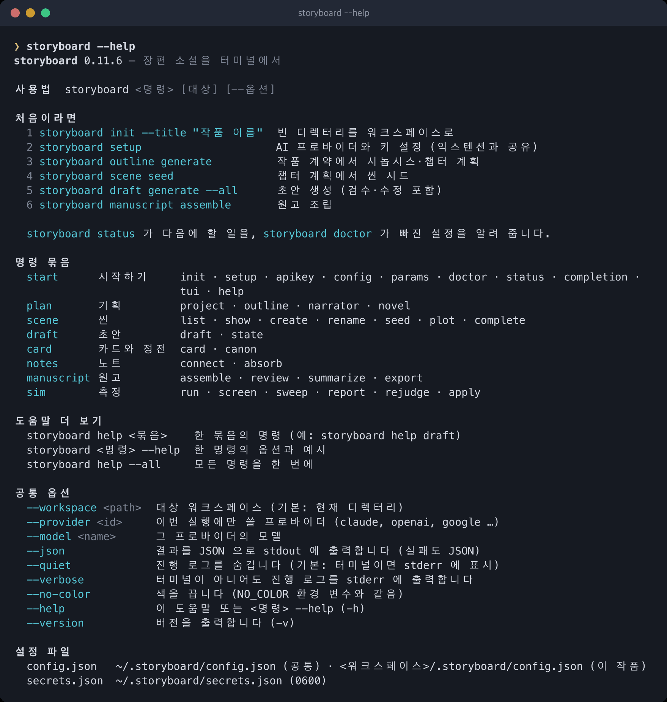

한 묶음만 보려면 `storyboard help <묶음>`, 한 명령의 옵션과 예시는 `storyboard <명령> --help`,
전부 한 번에 보려면 `storyboard help --all`입니다.

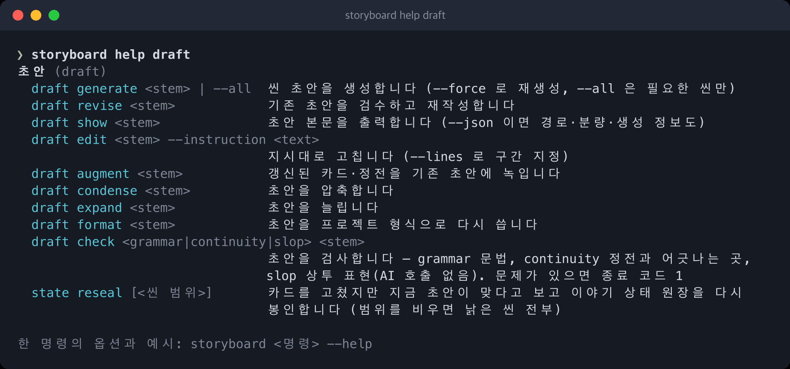

## 2) 작품 현황과 다음 명령

`storyboard status`는 계약·아웃라인·카드·씬·초안·정전 후보·원고를 한 번에 보여 주고, 마지막
줄에 다음에 실행할 명령을 적습니다. `--json`이면 같은 내용이 `data.next`로 나갑니다.

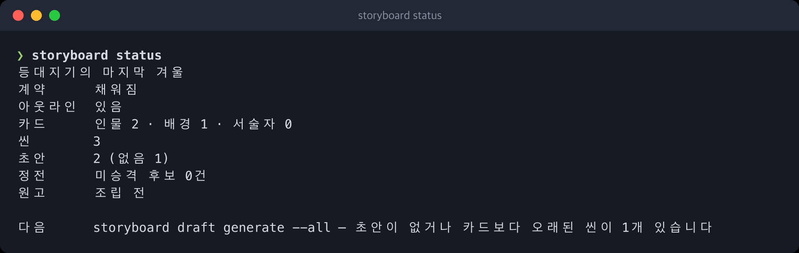

## 3) 환경 점검

`storyboard doctor`는 터미널에서 환경 · AI · 리소스 파일 · 작품을 상자 하나씩으로 그리고, 맨
아래에 통과·경고·실패 수를 적습니다. 실패가 있으면 종료 코드가 1입니다.

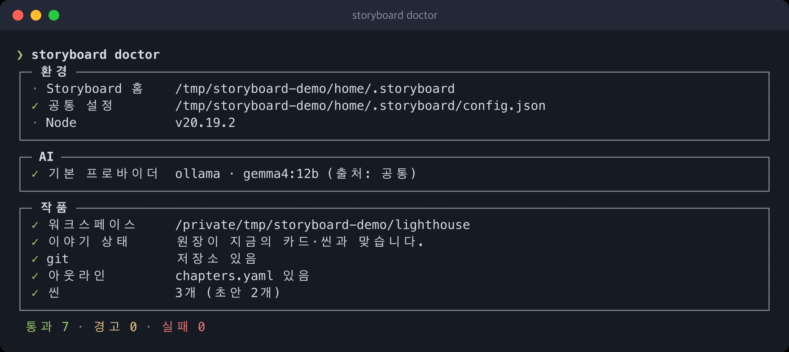

## 4) 오타와 옛 명령 이름

옵션 이름을 잘못 치면 가까운 옵션을, 없는 명령을 치면 같은 동작을 하는 지금의 명령을 알려
줍니다. 이름이 바뀐 명령(`scene generate` → `draft generate` 등)도 여기서 안내됩니다.

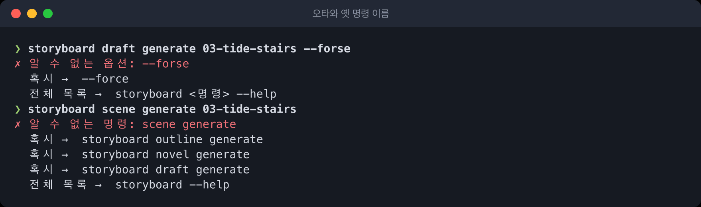

## 5) 긴 실행의 진행 레일

`draft generate --all`과 `novel generate`처럼 오래 걸리는 명령은 터미널 맨 아래에서 제자리에
갱신되는 레일로 진행을 보여 줍니다. 지금 단계, 몇 번째 씬인지, 걸린 시간이 한 줄에 나오고 경고는
그 위로 쌓입니다. Ctrl+C를 한 번 누르면 지금 씬을 마치고 씬 경계에서 멈춥니다.

작품을 바꾸는 명령이 끝나면 `✓`와 함께 다음에 실행할 명령이 붙습니다.

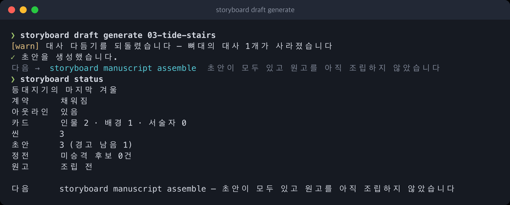

## 6) 바뀐 문장 보기

초안을 다시 쓰는 명령은 끝난 뒤 바뀐 문장만 골라 보여 줍니다. 같은 문장은 «N문장 같음»으로
접힙니다. 고치기 전 초안은 `.draft/`에 남습니다.

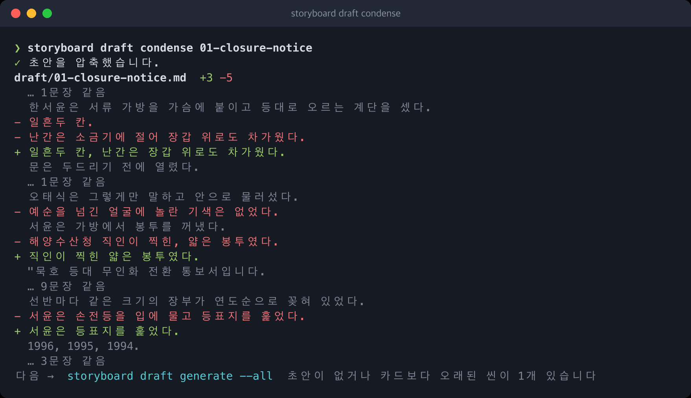

## 7) 비용이 드는 단계 앞의 선택 상자

`notes absorb`는 노트를 읽은 뒤 AI 요청 수와 예상 비용을 선택 상자에 담아 묻습니다. ↑↓나
숫자로 고르고 Enter, Esc는 취소입니다. 터미널이 아니면 견적에서 멈추고, `--yes`를 주면 묻지 않고
진행합니다.

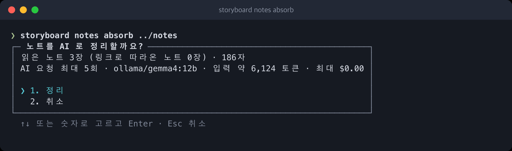

## 8) 질문으로 시작하는 init

터미널에서 `storyboard init`을 제목 없이 실행하면 작품 이름부터 차례로 묻습니다. 비워 둔 항목은
나중에 `project set`으로 채울 수 있습니다. 파이프에서는 종전처럼 `--title`이 필요합니다.

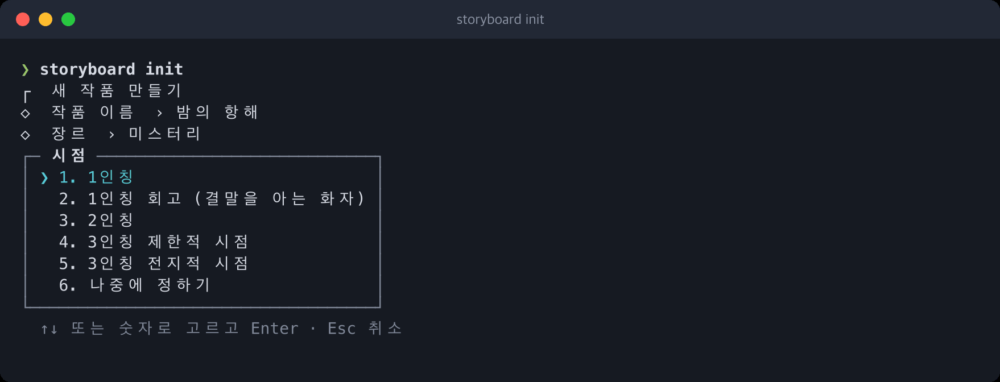

## 9) 대화형 화면

터미널에서 인자 없이 `storyboard`를 실행하면(또는 `storyboard tui`) 대화형 화면이 열립니다.
워드마크 아래에 작품 현황과 다음 명령이 나오고, 맨 아래 상태 줄에 작품 이름 · 쓰기 가능 여부 ·
프로바이더와 모델이 보입니다. 프롬프트에는 한 번에 실행하는 명령을 그대로 칩니다.

### 자동완성

치는 동안 명령, 옵션, 검사·카드 종류, 씬 stem이 목록으로 따라옵니다. ↑↓로 고르고 Tab으로
확정합니다. 셸의 Tab 완성과 같은 목록입니다.

### `@`로 씬과 카드 부르기

`@`를 치면 씬·인물·배경·서술자가 목록으로 나옵니다. `!`로 시작하면 셸 명령을 실행하고, 실행 중에는
Esc로 멈춥니다. `vim`처럼 화면 전체를 그리는 프로그램은 여기서 실행할 수 없으니 터미널에서 직접
실행하세요.

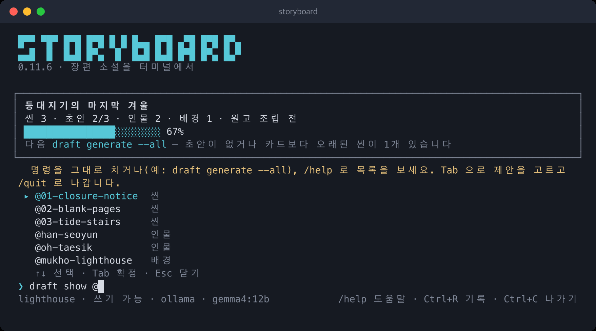

### 비용이 드는 명령의 확인

대화형 화면에서는 AI를 부르는 명령을 실행하기 전에 대상과 모델을 보여 주고 확인을 받습니다. 한
번에 실행하는 명령(`storyboard draft generate --all`)에는 이 질문이 없습니다.

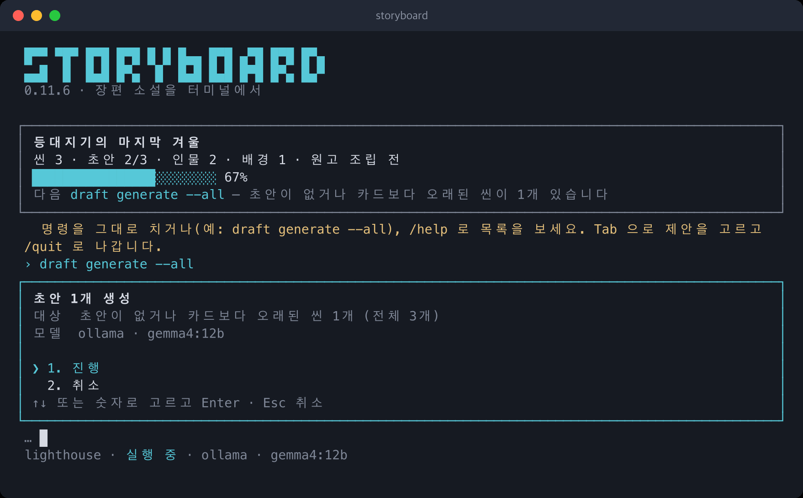

### `/model` · `/config` · `/theme` · `/cost`

`/model`은 프로바이더와 모델을 고르고, `/config`는 설정 값을 고쳐 쓰고, `/theme`는 색 테마(기본 ·
밝은 배경 · 무채색)를 바꾸고, `/cost`는 이 화면에서 쓴 비용을 보여 줍니다.

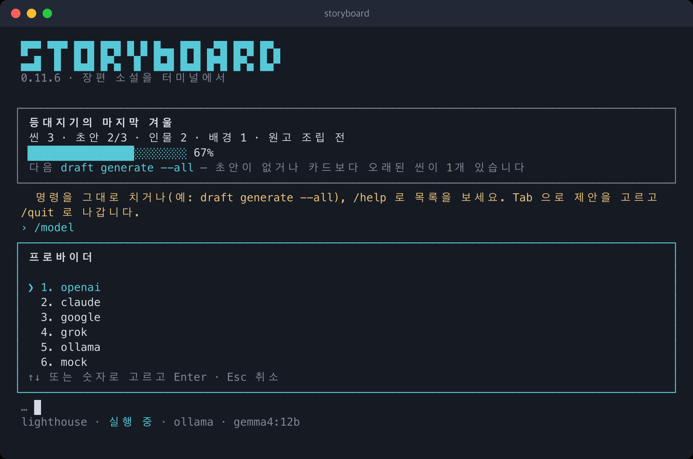

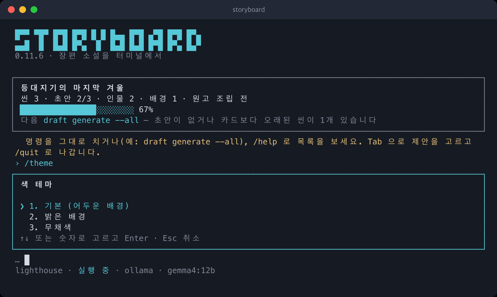

### 초안 읽기 화면

`draft show <stem>`은 초안을 읽기 화면으로 엽니다. ↑↓는 한 줄, Space/b는 한 쪽, g/G는 처음과
끝, q는 닫기입니다.

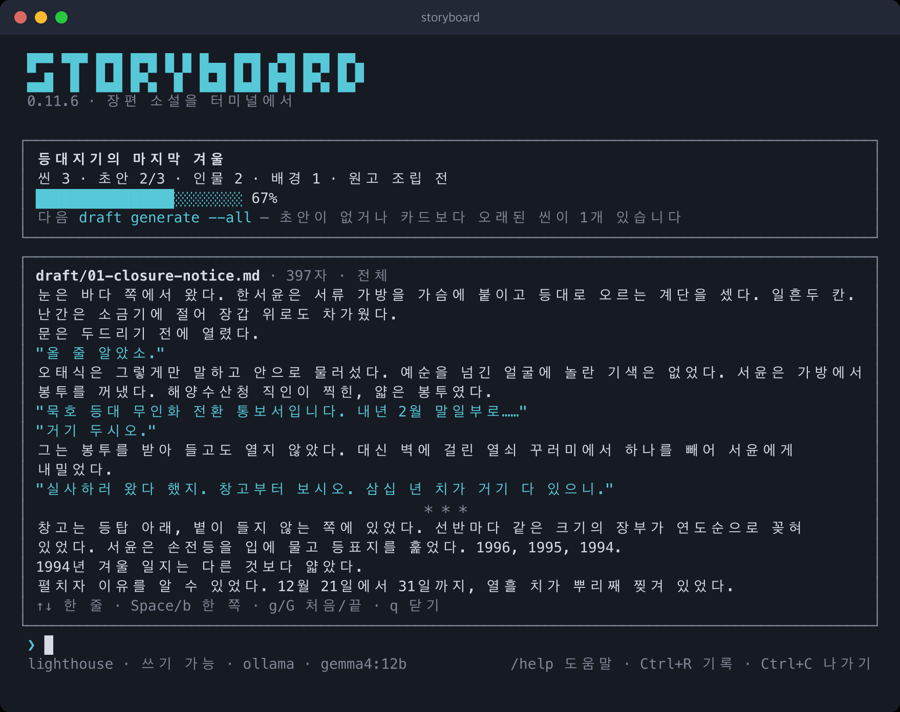

### 긴 결과 접기

긴 결과는 앞 12줄만 보이고 Ctrl+O로 펼치거나 접습니다. Ctrl+R은 입력 기록을 찾습니다.

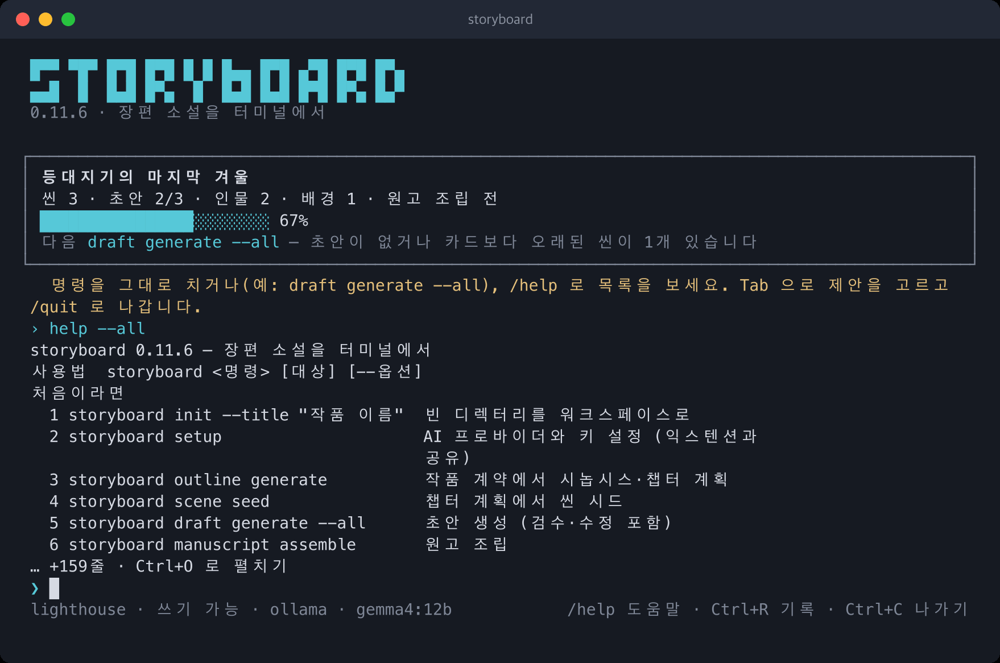

---

스크린샷은 예시 작품(씬 3개)과 로컬 모델 자리에 세운 대역 서버로 찍었습니다. 본문은 손으로 쓴
예시이며 실제 모델의 출력이 아닙니다.
