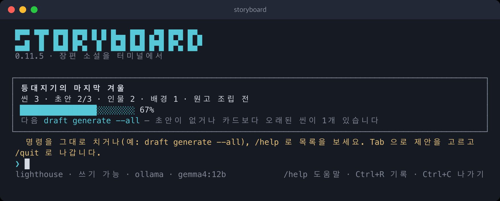
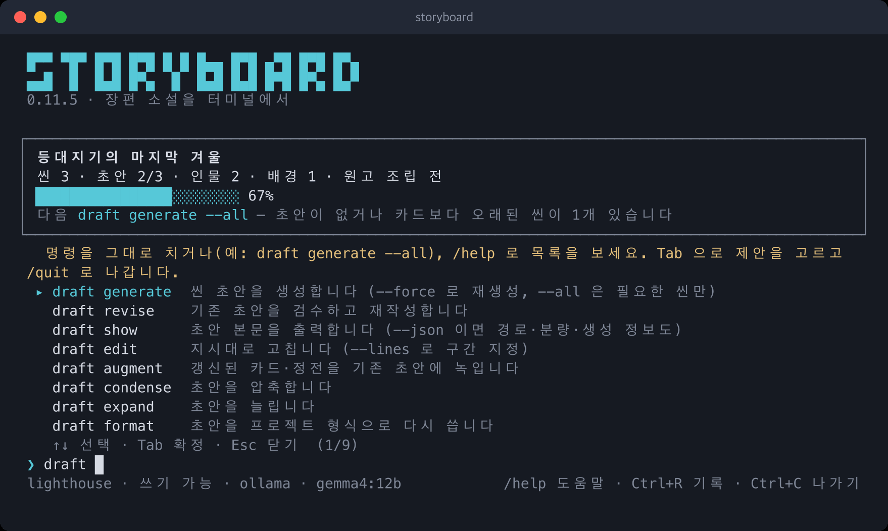
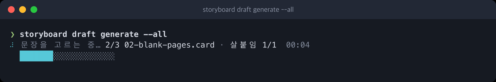

# storyboard (CLI)

Storyboard from a terminal. Same engine as the VSCode extension, no editor required — which is what
lets another AI agent drive a Storyboard workspace.



What each screen looks like — help, `status`, `doctor`, the progress rail, the sentence diff and the
interactive screen — is in the [screen guide](GUIDE.md) (Korean).

## Install

```bash
curl -fsSL https://raw.githubusercontent.com/maroomir/storyboard/main/scripts/install.sh | bash
```

The script resolves the latest release, verifies the checksum, unpacks into
`~/.local/share/storyboard` and links `~/.local/bin/storyboard`. The artifact is a bundled Node
script, so the machine needs **Node 20 or newer**.

From a checkout:

```bash
npm install && npm run cli:build && node apps/cli/dist/index.mjs --help
```

## First run

```bash
storyboard init --title "밤의 항해"   # an empty directory becomes a workspace (and a git repository)
storyboard setup                      # pick the AI provider (and key) — shared with the extension
storyboard project set --genre …      # the contract the outline needs (init takes the same flags)
storyboard doctor                     # what is still missing, with the command that fixes it
storyboard status                     # where the work stands, and the command to run next
```

`init` also writes `AGENTS.md` (and a `CLAUDE.md` that imports it) for coding agents working in the
workspace: draft through `storyboard` verbs instead of writing `draft/*.md` by hand, judge by exit
code, ask before changing the contract, the budget or the model. Existing files are never
overwritten; fill in its last section with the work's own notes.

`doctor` looks at the workspace for what an older Storyboard left behind: missing `draft/`/`scene/`, a stale `.gitignore` block, cards it cannot parse. It also checks the story-state
ledger (`.storyboard/memory/storyState.md`) against the current cards and scenes: entries whose
scene has been edited since are reported as stale, and generation drops them from the prompt until
you regenerate that scene. When the edit was one you do not want redrafted — beats added to a card
whose prose still stands — `storyboard state reseal [<scene range>]` records the current cards as the
ledger's basis instead, which is the only way to clear that mark without regenerating. The chapter summaries (`.storyboard/memory/summaries.md`) are checked the
same way against the drafts they were written from, and `storyboard manuscript summarize` refreshes
the ones that no longer match. `storyboard init --repair` restores the directories, `.gitignore` and any missing agent guide
(`AGENTS.md`, `CLAUDE.md`) of an existing workspace without touching the contract (a plain `init` refuses one) and seals a
pre-0.8 ledger against today's cards and scenes, so edits made after the repair are what count as
stale. `doctor` also counts the scenes without beats (fix: `scene plot --all`), and it warns
when the configured model cannot reach the largest scene target — measured, not guessed, and silent
for combinations that were never measured.

`storyboard --help` prints these steps and the command groups, not every command;
`storyboard help <group>` lists one group (by its id — `start`, `plan`, `scene`, `draft`, `card`,
`notes`, `manuscript`, `sim` — or its Korean name), `storyboard help --all` lists every command, and
`storyboard <command> --help` (or `-h`) shows one command's options and examples. Lines wrap to the
terminal width, and a mistyped verb suggests the closest real ones. `-v` prints the version.

## Commands

Every command on a work is `<noun> <verb> [target] [--options]`, two words. The noun is the kind of
file it touches — `project`, `outline`, `narrator`, `scene`, `draft`, `card`, `canon`, `notes`,
`manuscript` — always singular, and the verb comes from one small vocabulary: `list` and `show` to
look, `create` / `rename` / `remove` / `set` to change, `generate` / `revise` / `check` and the like
for AI work, `diff` / `promote` for candidates. A kind is an argument, never part of the name:
`card create character`, `draft check slop 01-intro`, `notes connect notion`. One-word commands
(`init`, `setup`, `doctor`, `status`, `help`, `tui`, `completion`) are about the machine or the
session rather than a file of the work.

`scene` is the scene card and `draft` is the prose written from it: `scene list|show|create|rename|
seed|plot|complete` against `draft generate|revise|show|edit|augment|condense|expand|format|
check`. `storyboard --help` groups the commands the same way: 시작하기, 기획, 씬, 초안, 카드와 정전,
노트, 원고, 측정.

```bash
storyboard status                 # contract, outline, cards, scenes, drafts, manuscript + next command
storyboard project show           # the contract, and which fields are still empty
storyboard scene list             # scene cards in number order, each with its draft state
storyboard draft show 01-intro    # the draft's body on stdout
storyboard card list character    # cards of one kind (leave the kind out for both)
storyboard card show hana         # one card, found by id
```

`status --json` carries the same counts plus `data.next` (`step`, `command`, `reason`), so an agent
can ask what to run next and branch on it.

## Tab completion

`install.sh` registers completion for the shell it runs in (zsh, bash or fish) by appending one
line to your rc file, guarded by a `# storyboard completion` marker. To do it by hand:

```bash
eval "$(storyboard completion zsh)"      # ~/.zshrc
eval "$(storyboard completion bash)"     # ~/.bashrc
storyboard completion fish | source      # ~/.config/fish/conf.d/storyboard.fish
```

Tab then completes verbs (with a one-line description in zsh and fish), the flags each verb takes,
provider and model ids, config keys, and the scene stems and card ids in the current workspace (or
the one named by `--workspace`). The shell asks the hidden `storyboard __complete <words…>` verb,
which reads the same command catalog the help does.

## Interactive screen

`storyboard` with no arguments at a terminal opens an Ink-based screen: a header with the
workspace and the AI provider in effect, a log where results and progress lines land, and a prompt
that accepts the same verbs as the one-shot CLI. Typing shows matching verbs (Tab completes, ↑/↓
picks, Esc clears), `/help` lists everything, `/doctor` and `/setup <id>` run those verbs, `/quit`
or Ctrl+C leaves. `storyboard tui` opens it explicitly; in a pipe it refuses and points back to the
one-shot form, so agents never end up inside it.



A long run draws a progress rail in place, and one Ctrl+C stops it at the next scene boundary:



More screens: [GUIDE.md](GUIDE.md).

## Use

```bash
storyboard init --title "시그널" --genre "하이틴 로맨스" --audience "10~20대" \
  --pov third-limited --target-words 480000 --chapters 8 --scenes-per-chapter 4
storyboard outline generate
storyboard scene seed
storyboard scene plot 01-scene-1-1 --dry-run
storyboard draft generate 01-scene-1-1 --force
storyboard draft generate --all
storyboard draft revise 01-scene-1-1
storyboard novel generate
storyboard manuscript assemble && storyboard manuscript review
```

`novel generate` is unattended: every approval gate is passed automatically, and a run the desktop
app or the extension started in an approval mode is continued the same way. At a terminal it asks
whether to continue an interrupted run or start over; in a pipe or with `--json` it continues.

`outline generate` refuses until the contract names a genre, an audience, a point of view and a
target word count, so `init` takes them as flags. `--from <json>` reads the same fields from a file
(a whole `project.json` works too), and flags win over the file. To change the contract later, use
the same inputs on `project set` — keys you leave out keep their current value:

```bash
storyboard project set --target-words 320000 --from contract.json
```

### 시점과 구성

`--pov` 는 `first`, `first-retrospective`, `second`, `third-limited`, `third-omniscient` 다섯 가운데
하나이고, 그 값 하나가 작품 전체의 서술 인칭과 지식 경계를 정한다. 씬마다 시점을 달리하려면
서술자에 이름을 붙인다:

```bash
storyboard narrator create hana-first --person first --focal hana --voice "건조한 단문"
storyboard narrator list
```

만든 뒤 씬 카드의 `narrator:` 에 그 id 를 적으면 그 씬만 그 시점으로 생성된다. 장 단위로 바꾸려면
`.storyboard/outline/chapters.yaml` 의 장에 `narrator:` 를 적는다 — 씬 시드를 만들 때 씬 카드로
복사되고, 씬 카드의 값이 장의 값을 이긴다.

구성은 프리셋으로 고른다. 프리셋이 연속성 줄기(`threads`)와 서술자 카드를 대신 만든다:

```bash
storyboard init --title "네 개의 밤" --composition omnibus --episodes 4
storyboard project set --composition alternating-pov --pov-characters hana,jun --pov first
```

- `linear` — 지금까지의 동작. 줄기 하나.
- `omnibus` — 편마다 독립된 사건과 결말. 이야기 상태·장 요약·직전 씬 맥락이 편 안에서만 이어지고,
  캐넌만 공유한다.
- `alternating-pov` — 인물마다 서술자 카드를 만들고 장마다 번갈아 배정한다.
- `frame` — 외화가 내화를 감싸고, 외화는 첫 장과 마지막 장에 놓인다.

씬 하나가 어떤 시점으로 생성될지는 `scene show` 가 해석된 결과로 보여 주고, 끊긴 서술자 참조나
작품 계약에 없는 줄기는 `doctor` 가 미리 잡는다:

```bash
storyboard scene show 03-night-market
```

A scene's file name is its key: the draft, its `.draft/` history, the summary, the caches, the
dialogue memory and the studio sessions are all named after the stem, and the story-state ledger
and canon refer to it by stem or by number. `scene rename` moves and rewrites all of them together.
It refuses a number another scene already holds, so to insert a scene, move the later scenes up
first, starting from the last one. A new number also gives the scene the outline slot and chapter
that number maps to.
If a rename is cut off partway, `doctor` reports it. While the old card is still there, run the
same `scene rename` it names again to finish. Files with the old name and no card can be deleted.

```bash
storyboard scene rename 03-night-market --to 04-night-market
```

Notes kept in Obsidian or Notion come in with `notes absorb`. It reads a vault folder (or one note)
or a Notion page with everything under it, plus the notes they link to one step away, and sorts
them into character and background cards, scene cards and a synopsis. It shows the cost estimate
first and asks before writing; an agent passes `--yes`, and `--dry-run` stops at the plan. Cards
that already exist are never overwritten — what the notes add to them waits for `card promote`,
and absorbing more notes adds to what is waiting rather than replacing it. Where two notes give one
slot different values, `card promote` holds it back and `card discard <id> --change <ref>` keeps one.
A Notion page needs an integration token once (`notes connect notion`) and the page shared with
that integration. A new work can start from notes in one step:

```bash
storyboard init --title "달의 문" --from-notes ~/Vault/달의문
storyboard notes absorb https://www.notion.so/team/Moon-Gate-1429989fe8ac4effbc8f57f56486db54 --yes
```

`card build` and `scene complete` write their proposals. Pass `--dry-run` to see the proposal
without touching the tree. A new card whose name yields no ascii id is reported rather than filed
under a guessed id — create it with `card create background --name "방송실" --id broadcast-room`
and run `card build` again.

Progress lines go to stderr whenever stderr is a terminal (`--quiet` hides them, `--verbose`
forces them for pipes). Color appears only at a terminal; pipes, `--json`, `NO_COLOR` and
`TERM=dumb` stay plain, and `--no-color` turns it off. Setup failures name the fix: no workspace → `storyboard init`, no provider
→ `storyboard setup`, no key → `storyboard apikey set` (asks for the provider, hides the key as you paste it, and checks the connection; `apikey show` lists which providers have a key).

A draft is only as long as the events its scene card carries, so `draft generate` first expands
the card's `beats` when it has none — from the structured fields, the grounding facts and the
summary in `scene/<stem>.summary.md` (staying inside that summary when there is one) — and writes
them to the card before drafting. `scene plot <stem> | --all` runs that step on its own so you can
read the beats before spending a generation: `--dry-run` only prints the proposal, `--all` picks the
scenes without beats, and existing beats are regenerated only with `--force`. The count is
`max(generation.beats.minimum, ceil(targetWordCount / generation.beats.charsPerBeat))` (defaults 5 and 1,500);
`generation.beats.auto: false` turns the automatic step off.

`draft generate` prints the draft's warnings (a short draft, for instance) on stderr and, under
`--json`, in `data.warnings`; the exit code stays 0. `--verbose` also logs each pipeline stage as it
runs, which is how you tell a 20-minute scene apart from a hung one.

`--workspace <path>` picks the workspace (default: the current directory). `--json` puts a single
JSON object on stdout — for failures too (`{"ok":false,"message":…}`), so an agent never has to
parse loose text; progress and warnings always go to stderr. Exit code is 0 on success and non-zero
on failure.

```bash
storyboard draft show 01-scene-1-1 --json | jq -r .data.path
```

## Config

`~/.storyboard/config.json`, shared with the extension, overridden per workspace by
`.storyboard/config.json`. Keys are the extension's setting names without the `storyboard.` prefix.
`storyboard config show` prints the effective values with their origin (공통 / 이 작품 / 기본값) and
`storyboard config set <key> <value>` edits them with the same validation the settings panel uses.
`storyboard params show` goes wider: every value an author can move — the settings, the generation
knobs (a measured model profile over the pipeline default) and each prompt's temperature and output
limit — with where its current value comes from, plus the author resource files in force
(`prompts/<key>.md`, `craftContract.json`, `promptVariants.json`, `compositionPresets.json`,
`pipelines/scene.yaml`, `pipelines/novel.yaml` under `~/.storyboard/` or the workspace's
`.storyboard/`). `storyboard doctor` fails on a resource file it cannot use and says why.

Writes follow git's rule: run inside a workspace and the value lands in that workspace's
`.storyboard/config.json`; add `--global` to write `~/.storyboard/config.json` instead. Outside a
workspace, `config set` and `setup` refuse rather than guess — pass `--global` (or `--workspace`).
Because the workspace layer wins the merge, a `--global` write that the current workspace overrides
says so instead of looking like it did nothing. API keys ignore all of this: they only ever live in
the one 0600 home file.

```json
{ "ai.provider.default": "claude", "tasks": { "sceneDraft": { "provider": "claude", "model": "claude-sonnet-5" } } }
```

A task can run on its own provider and model (`tasks.<task>.provider|model`, task names from
`config set`'s error message or shell completion). Give both at once with `--model`, which
`ai.provider.default` takes too; a lone model takes the default provider with it, and a provider
change drops a model the new provider does not have. `config show` lists only the routed tasks.
`storyboard config unset <key>` removes a key from the file this run writes to — the whole route for
`tasks.<task>.provider` — and says so when the other file still holds a value.

```bash
storyboard config set tasks.noteExtraction.provider claude --model claude-opus-5-5 --global
storyboard config unset tasks.noteExtraction.provider --global
```

Two tasks decide most of what a draft reads like: `sceneSkeleton` lays out the scene and writes
every line of dialogue, and `sceneSectionExpansion` writes the prose around them. Both keep
length and voice better on a top-tier model, so when the default provider runs a mid-size model,
route those two up and leave the cheap tasks (grounding, beats, state updates) where they are:

```bash
storyboard config set tasks.sceneSkeleton.model claude-opus-5-5
storyboard config set tasks.sceneSectionExpansion.model claude-opus-5-5
```

Every provider Storyboard speaks to is reached with an API key (or runs locally, for `ollama`).
Subscription CLI providers were removed in 0.9.2: Anthropic, OpenAI and Google all limit a
subscription or account login to interactive personal use and direct programmatic and bulk
workflows to API keys, which is exactly what this app is for. A config file that still names
`claude-code`, `codex` or `gemini-cli` names nothing: the provider reads as unchosen and generation
refuses until you pick one, because the metered replacement bills at a different rate.

API keys live in `~/.storyboard/secrets.json` at mode 0600, shared by both apps. `STORYBOARD_HOME`
moves the whole directory. The pre-0.8 `cli.json` / `cli-secrets.json` are no longer read: rename
them to `config.json` / `secrets.json`, or run `storyboard setup` again.

## Generated text and provider policies

- **Check what the AI asserts.** Drafts, revisions, review notes and story-bible suggestions are
  model output. Treat any factual claim in them (history, geography, medicine, law, real people or
  places) as unverified until you have checked it yourself. If you hand this app to other writers,
  pass this notice on to them.
- **The provider's usage policy applies to the manuscript.** `openai`, `claude`, `google` and `grok`
  each apply their own content rules to what you generate (for example sexually explicit scenes,
  sexual content involving minors, or material that promotes violence). A request that crosses the
  line is refused by the provider, and repeated violations can restrict the API key or the account.
  `ollama` runs on your machine and no such policy applies.

## What this app does not do

- **It does not commit.** Files are written; git is yours. `init` does run `git init` (after writing
  the ignore block) so a new workspace starts tracked, but the first commit is yours too.
- **It has no editor chrome.** Inline completion, hover, the `.card` custom editor and the relation
  graph have no terminal form. The capabilities behind the diagnostics providers do, and become
  `check` verbs.

Verb coverage against the extension's command palette is enforced by `test/parity.test.ts`: a
command added to the extension without a CLI verb fails the build.
